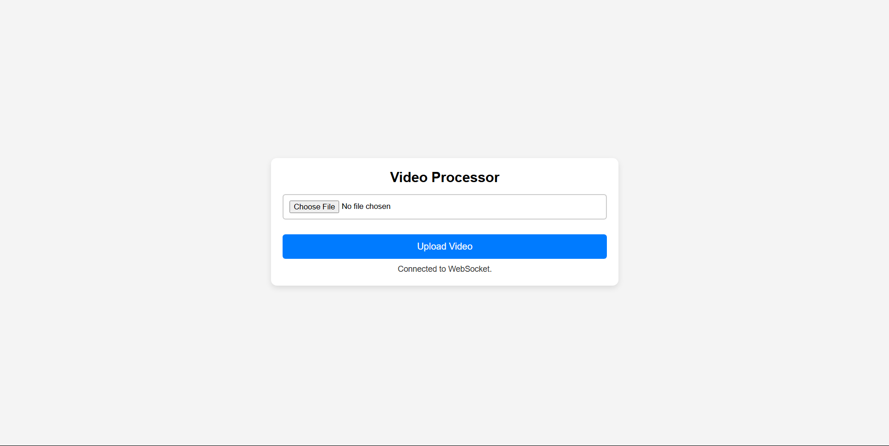
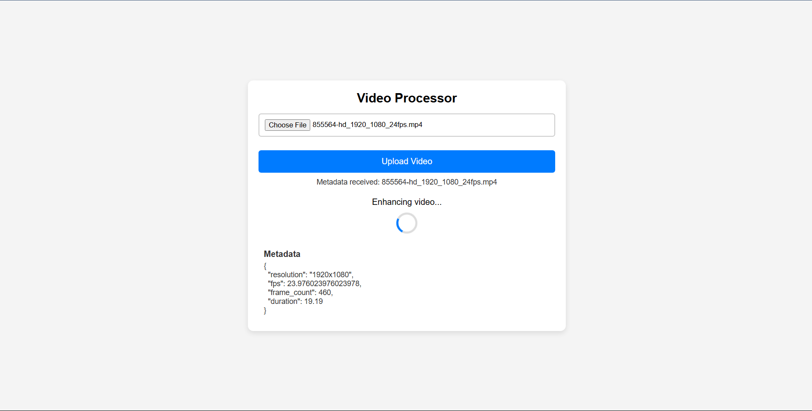
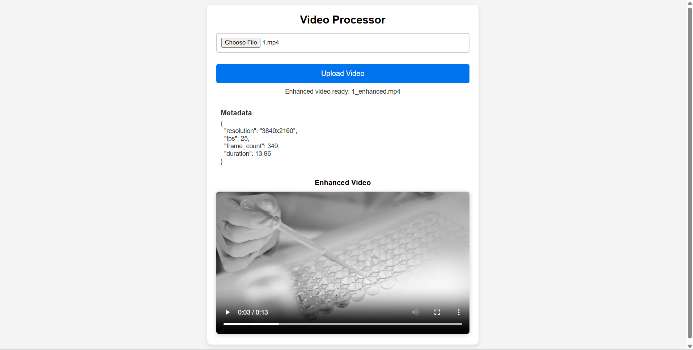

# 🎥 Video Processing Pipeline with FastAPI, RabbitMQ & FFmpeg

A **distributed event-driven video processing pipeline** that allows users to upload videos, extract metadata, and apply video enhancements using **FastAPI, RabbitMQ, FFmpeg, and WebSockets**.

## 📌 Features

✅ **Upload Videos** via a frontend interface  
✅ **Metadata Extraction** (Resolution, FPS, Frame Count, Duration)  
✅ **Video Enhancement** (Grayscale Conversion using FFmpeg)  
✅ **Real-time WebSocket Updates** for status tracking  
✅ **Asynchronous Event Processing** with RabbitMQ workers

---

## 🛠️ **Tech Stack**

- **Frontend:** React, CSS  
- **Backend:** FastAPI (Python)  
- **Queue:** RabbitMQ (Message Broker)  
- **Video Processing:** FFmpeg (Efficient video enhancement & encoding)

---

## 🚀 **Installation & Setup**

### 1️⃣ **Clone the Repository**

```sh
git clone https://github.com/your-username/AugustAI_videoprocessor.git
cd AugustAI_videoprocessor
```

### 2️⃣ **Backend Setup (FastAPI + RabbitMQ + FFmpeg)**

**Go to backend directory**

```sh
cd backend
```
**Install Dependencies**

```sh
pip install -r requirements.txt
```

**Start RabbitMQ**

```sh
sudo systemctl start rabbitmq-server # Linux/macOS
rabbitmq-server # Windows (Run as admin)
```

**Run the FastAPI Server**

```sh
uvicorn server:app --host 0.0.0.0 --port 8000 --reload
```

**Run Metadata Extraction Worker**

```sh
python metadata_worker.py
```

**Run Video Enhancement Worker**

```sh
python video_enhancer.py
```

### 3️⃣ **Frontend Setup (React)**

**Navigate to Frontend Directory & Install Dependencies**

```sh
cd frontend
npm install
```

**Start React App**

```sh
npm start
```

## 🎯 **How It Works**

**1️⃣ Upload Video**
* Users upload a video via the **React frontend**
* The video is sent to the **FastAPI backend**
* FastAPI **stores the file** and **publishes a task** to RabbitMQ

**2️⃣ Metadata Extraction Worker**
* Listens for tasks from **RabbitMQ**
* Extracts **Resolution, FPS, Frame Count, Duration**
* Sends **metadata** back to FastAPI

**3️⃣ Video Enhancement Worker**
* Listens for tasks from **RabbitMQ**
* Applies **grayscale enhancement** using FFmpeg
* Saves the **processed video**
* Sends **status update** to FastAPI

**4️⃣ WebSocket Updates**
* Frontend **receives real-time updates** via **WebSockets**
* Displays **metadata & enhanced video** dynamically


## ⚡ **API Endpoints (FastAPI)**

| Method | Endpoint | Description |
|--------|----------|-------------|
| `POST` | `/upload` | Uploads a video file |
| `POST` | `/internal/metadata-extraction-status` | Receives extracted metadata |
| `POST` | `/internal/video-enhancement-status` | Receives enhancement status |
| `WS` | `/ws` | WebSocket connection for real-time updates |

## 📸 **Screenshots**

### 🖼️ 1. Video Upload Screen  
Users can upload a video for processing.  


### 🖼️ 2. Processing Status  
The system extracts metadata and applies enhancements.  


### 🖼️ 3. Enhanced Video Output  
The processed video is displayed after enhancement.  


---

